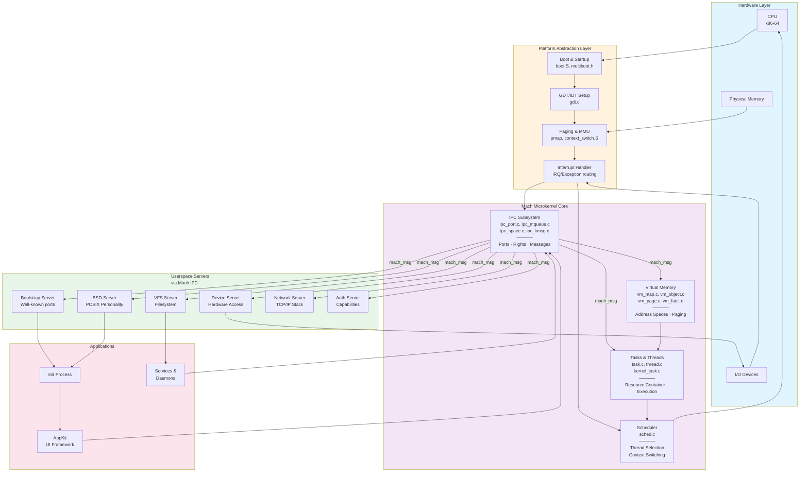

# UNHOX Kernel Architecture Diagram

## System Architecture



## Component Details

### Hardware Layer
- **CPU**: x86-64 processor (with AArch64 support planned)
- **Physical Memory**: Managed via platform-specific pmap
- **I/O Devices**: Accessed via device server in userspace

### Platform Abstraction
- **Boot**: `boot.S`, `multiboot.h` — Bootloader handoff
- **GDT/IDT**: Global/Interrupt Descriptor Tables setup
- **Paging**: Memory Management Unit (MMU) control, page table management
- **Interrupts**: IRQ and exception routing to kernel handlers

### Mach Microkernel Core (4 essential subsystems)

#### 1. **IPC (Mach Ports)**
- **Files**: `ipc_port.c`, `ipc_mqueue.c`, `ipc_space.c`, `ipc_kmsg.c`
- **Purpose**: Sole inter-process communication mechanism
- **Concepts**:
  - Ports as protected message queues
  - Rights (SEND, RECEIVE, SEND_ONCE)
  - Port rights = capabilities = permissions
  - Message passing with out-of-line memory

#### 2. **Virtual Memory**
- **Files**: `vm_map.c`, `vm_object.c`, `vm_page.c`, `vm_fault.c`
- **Purpose**: Per-task address spaces & page management
- **Concepts**:
  - VM maps store per-task address space
  - VM objects represent backing memory
  - External pagers (userspace) manage actual storage
  - Page faults trigger pager requests via IPC

#### 3. **Tasks & Threads**
- **Files**: `task.c`, `thread.c`, `kernel_task.c`
- **Purpose**: Resource containers and execution units
- **Concepts**:
  - Task = resource owner (address space, port namespace)
  - Thread = execution unit with stack, registers, state
  - Multiple threads per task share address space

#### 4. **Scheduler**
- **Files**: `sched.c`, context switching in `platform/`
- **Purpose**: Thread selection and CPU time allocation
- **Concepts**:
  - Decides which runnable thread executes next
  - Context switch via `context_switch.S`
  - Integrates with interrupt handlers

### Userspace Servers
All remaining OS functionality lives in userspace via Mach IPC:
- **Bootstrap**: Registers well-known service ports
- **Device**: Raw hardware access (I/O, interrupts)
- **VFS**: Filesystem and file operations
- **BSD**: POSIX syscalls, fork, signals, process model
- **Network**: TCP/IP stack, BSD sockets
- **Auth**: Capability delegation and access control

### Applications
- **Init**: First process started by BSD server
- **Services**: Daemons and background processes
- **AppKit**: User interface framework

## Data Flow

### IPC Message Flow
```
Client Task (send)
    ↓
Mach Message (port, data, rights)
    ↓
IPC Subsystem (validation, rights check)
    ↓
Server Task (receive)
    ↓
Handler processes request
    ↓
Reply Message
    ↓
Client Task (receive reply)
```

### Page Fault Flow
1. Thread accesses unmapped page
2. Platform triggers page fault interrupt
3. VM subsystem handles fault
4. If external pager needed:
   - Sends memory_object_data_request via IPC
   - Waits for pager response
   - Maps returned page
5. Resume faulting thread

### Scheduling Flow
1. Interrupt or system call
2. Scheduler evaluates runnable threads
3. Context switch to highest priority ready thread
4. Platform restores thread state (CPU registers, TLB, etc.)
