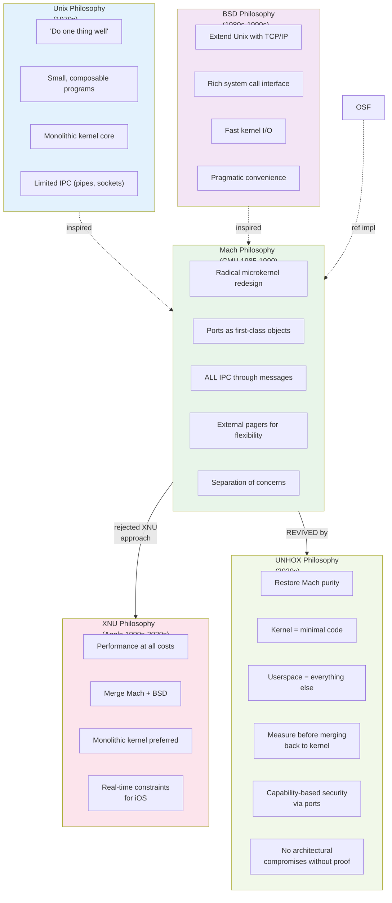
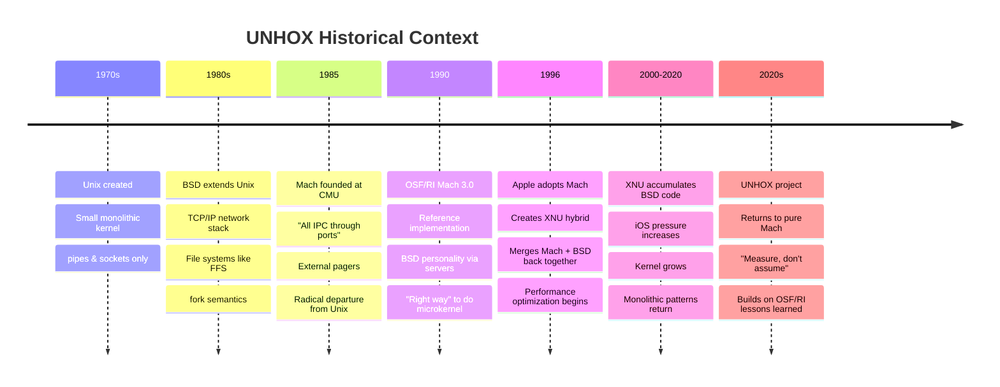

# UNHOX Kernel Heritage & Lineage Diagram

## Historical Lineage

```mermaid
graph LR
    subgraph Unix["Unix (1970s)"]
        UnixKern["Monolithic Kernel"]
        UnixIPC["Limited IPC<br/>pipes, sockets"]
        UnixVM["Virtual Memory"]
    end
    
    subgraph BSD["BSD (1980s-1990s)"]
        BSDKern["Monolithic Unix Kernel<br/>with extensions"]
        BSDNet["Network Stack<br/>TCP/IP"]
        BSDFS["Advanced FS<br/>FFS, NFS"]
        BSDExt["Process Model<br/>fork, signals"]
    end
    
    subgraph Mach["Mach (CMU 1985-1990)"]
        MachDesign["RADICAL REDESIGN"]
        MachPorts["Mach Ports<br/>First-class IPC"]
        MachCap["Capabilities<br/>Port Rights = Perms"]
        MachExtern["External Pagers<br/>Userspace Memory"]
        MachTask["Tasks & Threads<br/>Separate Concepts"]
    end
    
    subgraph OSF["OSF/RI Mach 3.0<br/>(1990s)"]
        OSFImpl["Reference Implementation"]
        OSFMach["Mature Mach"]
        OSFBSD["BSD Compatibility<br/>in Servers"]
        OSFRef["Rich Documentation<br/>& Examples"]
    end
    
    subgraph XNU["XNU (Apple 1990s-2020s)"]
        XNUHybrid["HYBRID DESIGN:<br/>Mach + BSD merged"]
        XNUIssue["Performance pressure →<br/>collapsed BSD back<br/>into kernel"]
        XNUTrade["Lost Mach purity<br/>for macOS/iOS speed"]
    end
    
    subgraph UNHX["UNHOX (2020s)<br/>Pure Mach Revival"]
        UNHXMission["PRINCIPLE:<br/>Restore Mach purity<br/>without XNU's shortcuts"]
        UNHXCore["Minimal Kernel<br/>IPC, VM, Tasks, Threads"]
        UNHXServers["Layered Userspace<br/>BSD, VFS, Network,<br/>Device, Auth servers"]
        UNHXCapabilities["Port-based<br/>Capabilities<br/>No ACL matrix"]
        UNHXMeasure["Microkernel only where<br/>proven by benchmark,<br/>not ideology"]
    end
    
    Unix -->|"Foundation"| BSD
    BSD -->|"Inspiration"| Mach
    Mach -->|"Reference impl"| OSF
    OSF -->|"Extended"| XNU
    Mach -->|"Returns to roots"| UNHX
    BSD -->|"Reimplemented in<br/>userspace"| UNHX
    
    style Unix fill:#e3f2fd
    style BSD fill:#f3e5f5
    style Mach fill:#e8f5e9
    style OSF fill:#fff3e0
    style XNU fill:#fce4ec
    style UNHX fill:#f1f8e9
```

## Design Philosophy Comparison

## Architecture Comparison

```mermaid
graph TB
    subgraph UnixArch["Unix Monolith"]
        UK["KERNEL<br/>VFS, FS, TCP/IP,<br/>Process mgmt,<br/>Device drivers"]
        UP["User Programs"]
        UK -->|syscalls| UP
    end
    
    subgraph BSDArch["BSD Monolith + IPC"]
        BK["KERNEL<br/>VFS, FS, TCP/IP,<br/>Signals, fork,<br/>Device drivers"]
        BP["User Programs"]
        BK -->|syscalls| BP
        BK -.->|pipes, sockets| BP
    end
    
    subgraph MachArch["Mach Microkernel"]
        MK["MINIMAL KERNEL<br/>Ports · VM · Tasks · Threads"]
        MS["Mach Servers<br/>BSD, Device, VFS,<br/>Network, Auth"]
        UP2["User Programs"]
        MK -->|mach_msg| MS
        MK -->|mach_msg| UP2
        MS -->|mach_msg| UP2
    end
    
    subgraph XNUArch["XNU Hybrid<br/>Best of both?<br/>Worst of both?"]
        XK["KERNEL<br/>Mach primitives +<br/>BSD collapsed in<br/>(VFS, network, signals)"]
        XS["Some Servers<br/>Device drivers"]
        XUP["User Programs"]
        XK -->|mach_msg| XS
        XK -->|Mach + syscalls| XUP
    end
    
    subgraph UNHXA["UNHOX Microkernel<br/>Mach Done Right"]
        UK2["MINIMAL KERNEL<br/>IPC, VM, Tasks,<br/>Threads, Scheduler<br/>NO monolithic code"]
        US["Pure Userspace<br/>Bootstrap, BSD,<br/>Device, VFS, Network,<br/>Auth, custom services"]
        UP3["Applications"]
        UK2 -->|mach_msg| US
        UK2 -->|mach_msg| UP3
        US -->|mach_msg| UP3
    end
    
    style UnixArch fill:#e3f2fd
    style BSDArch fill:#f3e5f5
    style MachArch fill:#e8f5e9
    style XNUArch fill:#fce4ec
    style UNHXA fill:#f1f8e9
```

## Key Historical Decisions

## Key Design Decisions: UNHOX vs Predecessors

| Aspect | Unix | BSD | Mach | XNU | UNHOX |
|--------|------|-----|------|-----|-------|
| **Kernel Philosophy** | Monolithic | Monolithic + TCP/IP | Minimal Microkernel | Hybrid (Mach+BSD) | Pure Microkernel |
| **IPC Mechanism** | Pipes, sockets | Pipes, sockets, RPC | Mach ports | Mach ports | **Mach ports only** |
| **Process Model** | Process = memory + execution | fork/exec + signals | Task + Threads | Mach + BSD syscalls | Tasks + Threads only |
| **Memory Management** | Kernel paged memory | Kernel control | External pagers | Mach + BSD VM | **External pagers** |
| **Filesystems** | In kernel | In kernel (VFS, FFS) | Userspace servers | In kernel | **Userspace servers** |
| **Network Stack** | N/A | In kernel (TCP/IP) | Userspace servers | In kernel | **Userspace servers** |
| **Device Drivers** | In kernel | In kernel | Mostly userspace | In kernel + HAL | **Userspace servers** |
| **Security Model** | UIDs/GIDs + permissions | UIDs/GIDs + permissions | **Port capabilities** | Mach + BSD DAC | **Port capabilities** |
| **Scheduling** | Fair-share, simple | Priority-based | Real-time ready | Real-time + BSD | Priority-based |
| **Design Mantra** | "Do one thing" | "No artificial limits" | "All IPC is Mach" | "MacOS speed now" | "Measure before merge" |

## Genealogy Summary

- **Unix (1970)** → foundational concept of process, memory, files
- **BSD (1980s)** → TCP/IP, modern filesystems, POSIX veneer
- **Mach (1985-1990)** → revolutionary IPC-centric microkernel (CMU Accetta et al.)
- **OSF/RI Mach 3.0 (1990)** → reference implementation, BSD personality in servers
- **XNU (1996+)** → Apple's hybrid approach (Mach + BSD merged for performance)
- **UNHOX (2020s)** → revival of pure Mach principles + modern systems knowledge
  - Unlike XNU, resists pressure to merge userspace code back to kernel
  - Unlike original Mach, proves decisions with benchmarks
  - Builds on 35+ years of microkernel research and failure modes

## UNHOX's Unique Position

UNHOX stands at an interesting intersection:

| Heritage | Lesson Applied |
|---------|-----------------|
| Unix | Fundamental concepts: processes, memory, files are orthogonal abstractions |
| BSD | Practical POSIX compatibility is valuable; implement via servers, not kernel |
| Mach | Ports as capabilities; external pagers; minimal kernel |
| OSF MK | Server-based personality; reference implementation patterns |
| XNU | What NOT to do: only merge to kernel when benchmarks prove it necessary |
